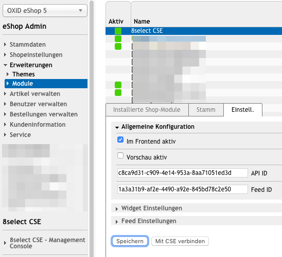

## Systemvoraussetzungen

### Kompatibel mit folgenden OXID eShop Versionen

- EE 5.0.x
- EE 5.1.x
- EE 5.2.x
- EE 5.3.x
- CE/PE 4.10.x/5.x

Ggf. kompatibel, jedoch nicht getestet:

- CE/PE 4.7.x
- CE/PE 4.8.x
- CE/PE 4.9.x

### Anforderungen an Webserver / MySQL / PHP / PHP Erweiterungen

Voraussetzung ist PHP 5.5.x.

Weitere Voraussetzungen ergeben sich aus denen der Oxid Version:

- [Oxid EE](https://docs.oxid-esales.com/eshop/de/5.3/installation/neu-installation/systemvoraussetzungen/systemvoraussetzungen-ee.html)
- [Oxid CE](https://docs.oxid-esales.com/eshop/de/5.3/installation/neu-installation/systemvoraussetzungen/systemvoraussetzungen-ce.html)
- [Oxid PE](https://docs.oxid-esales.com/eshop/de/5.3/installation/neu-installation/systemvoraussetzungen/systemvoraussetzungen-pe.html)

## Installation

1. Modul aus [OXID eXchange](https://exchange.oxid-esales.com/index.php?cl=search&searchparam=8select) laden.
2. Modul entpacken.
3. Auf Ihrem Webserver im Shopverzeichnis (Root-Pfad des Oxid Shops) den Unterordner `modules/asign/8select` anlegen.
4. Das entpackte Modul in diesen Ordner kopieren/hochladen.

## Modul aktivieren und konfigurieren

- Im OXID eShop Admin-Bereich in der Modul-Verwaltung das 8select-Modul auswählen und "Aktivieren".

- Unter dem Reiter "Einstell." im Abschnitt "Allgemeine Konfiguration" die API-ID und Feed-ID eingeben.
- Ausspielung der 8select-Widgets aktivieren:
  - entweder im Vorschau-Modus (für einen Testbetrieb - dann werden die Widgets nur ausgespielt wenn an die URL ein Parameter `8s_preview=1` angehängt wird, z.B. `https://www.my-shop.com/page?8s_preview=1`): dazu das Häkchen bei "Vorschau aktiv" setzen.
  - oder immer, d.h. für den Produktivbetrieb: dazu das Häkchen "Im Frontend aktiv" setzen.
- Nach diesen Einstellungen "Speichern".

- Ihren Oxid Shop im 8select-System registrieren: dazu den Button "Mit CSE verbinden" klicken.

Jetzt werden die Produktdaten aus dem Shop an 8SELECT übertragen und weiterverarbeitet. Nach ca. 24h steht der erste Content zur Verfügung.

Ob die Frontend Integration fehlerfrei funktioniert, kann mit Hilfe des Demo Modus getestet werden. Einfach den Parameter `8s-demo=true` an die URL hängen, z.B. `https://www.my-shop.com/page?8s-demo=true`.

## Deinstallation

1. Das Modul im OXID eSHOP Admin-Bereich in der Modul-Verwaltung deaktivieren.
2. Das Verzechnis "modules/asign/8select" löschen.
3. Folgende Datenbank-Tabellen löschen:

   - eightselect_log

## Changelog

Siehe [CHANGELOG](https://github.com/8select/oxid-plugin-sob/blob/master/CHANGELOG.md).
